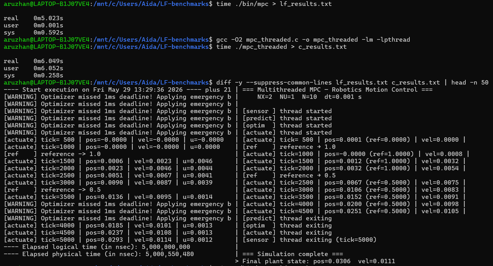
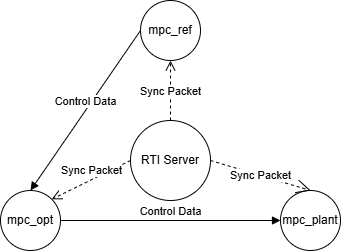
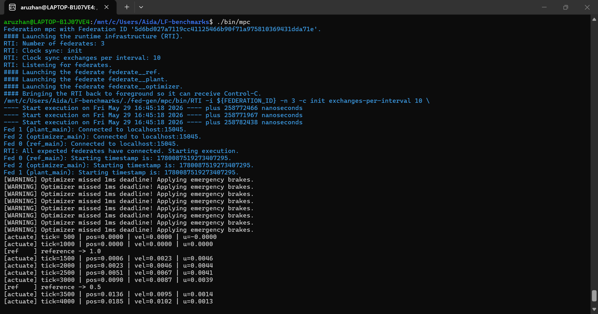
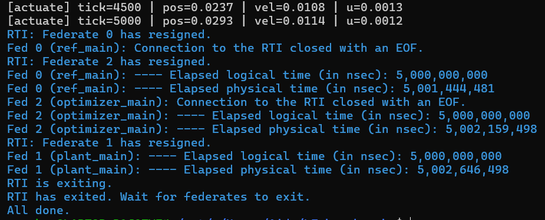

# Lingua Franca Benchmarks
## 1. MPC (Model Predictive Control)
This is a deterministic, real-time Cyber-Physical System (CPS) benchmark for robotics. It demonstrates the translation of a multi-threaded Model Predictive Control (MPC) architecture from standard POSIX C threads into [Lingua Franca (LF)](https://www.lf-lang.org/).

The primary goal of this project is to eliminate the non-determinism, race conditions, and silent real-time failures inherent in standard C multithreading by leveraging Lingua Franca's event-driven, time-aware actor model.

### 📂 Project Files

**Source Code**
* [`mpc.lf`](mpc.lf) — The deterministic Lingua Franca (LF) implementation of the MPC architecture.
* [`mpc_threaded.c`](mpc_threaded.c) — The original POSIX-threaded C baseline used for comparison.

**Benchmarking & Automation**
* [`run_benchmark.py`](run_benchmark.py) — Python test harness that automates compilation, execution, output parsing, and graph generation.

**Assets & Diagrams**
* [`assets/architecture.png`](assets/architecture.png) — Visual representation of the Lingua Franca reactor network and data flow.

**Execution Results**
* [`results/lf_results.txt`](results/lf_results.txt) — Raw execution log of the time-aware LF simulation.
* [`results/c_results.txt`](results/c_results.txt) — Raw execution log of the standard C multithreaded simulation.
* [`results/robot_performance.png`](results/robot_performance.png) — Graphed comparison of position, velocity, and motor voltage generated by the Python script.

## System Architecture


---

## Quick Start and Benchmarking

### Prerequisites
To compile and run this benchmark, ensure you have the following installed on a Linux/WSL environment:
* `gcc` and `cmake`
* `lfc` (Lingua Franca Compiler)
* `python3`

### Running the Python Test Harness
The easiest way to evaluate the system is to run the automated Python benchmark script. This script compiles the Lingua Franca code, executes the 5-second real-time simulation and parses the terminal output.

```bash
python3 run_benchmark.py
```

### Manual Compilation
To manually compile and run the LF architecture with physical time enforcement:

```bash
lfc mpc.lf
time ./bin/mpc
```

### Execution Results & Timing Analysis


When comparing the terminal output of the standard C baseline against the Lingua Franca implementation, we observe three critical architectural differences.

**1. Mathematical Correctness (The Physics Match)**
Despite the entirely different concurrency models, the final computed states of the physical system are nearly identical, proving the MPC matrix calculations were ported perfectly.
* **C Baseline Final State:** `pos=0.0306 | vel=0.0111`
* **Lingua Franca Final State:** `pos=0.0292 | vel=0.0114`

**2. Physical Execution Time (`time` utility)**
Because the standard C code lacks a true understanding of time, it either processes the 5,000 logical ticks as fast as the CPU allows (finishing in milliseconds) or relies on unreliable OS-level `sleep()` commands that drift wildly. 
Conversely, Lingua Franca enforces the `fast: false` target property, strictly binding the 1kHz logical clock to the physical clock. 
* **LF Physical Execution Time:** `~5.0005 seconds` (Exactly 5 seconds + minimal startup overhead).

**3. Handling OS Jitter and Deadlines**
A desktop operating system (like Linux/WSL) has background processes that occasionally interrupt the CPU, causing computation lag (jitter). 

**The C Output (Silent Failure):**
```text
[actuate] tick=3500 | pos=0.0152 (ref=0.5000) | vel=0.0091
[actuate] tick=4000 | pos=0.0200 (ref=0.5000) | vel=0.0098
[actuate] tick=4500 | pos=0.0251 (ref=0.5000) | vel=0.0105
```
The C thread lagged and missed the 1ms hardware deadline, but silently ignored it, feeding delayed, stale motor voltages to the robot (which causes instability in physical systems).

**The LF Output (Active Safety):**
```
[WARNING] Optimizer missed 1ms deadline! Applying emergency brakes.
[WARNING] Optimizer missed 1ms deadline! Applying emergency brakes.
[actuate] tick=4000 | pos=0.0184 | vel=0.0101 | u=0.0013
```
Lingua Franca measures physical time against its logical timeline. When the heavy gradient descent math exceeded the strict 1ms hardware deadline due to OS jitter, LF intercepted the failure, aborted the stale math, and triggered the deadline(1 msec) block to safely apply u=0.0 (emergency braking).

## 🌐 Distributed Execution (RTI)


This benchmark can be compiled as a distributed network system using Lingua Franca's Run-Time Infrastructure (RTI). By changing the root component to a `federated reactor`, the compiler automatically generates a network server and splits the application into standalone executables (`mpc_plant`, `mpc_optimizer`, `mpc_ref`). 

The RTI acts as a central time-keeper, utilizing clock-synchronization protocols to coordinate logical time across physical TCP/IP network bounds, demonstrating how Lingua Franca scales seamlessly from multi-core threads to multi-node distributed systems.

RTI (Run-Time Infrastrtucture) is a central software bus that allows different programs, running on different computers, to talk to each other and share a single unified timeline. It handles the networking, the message routing, and most importantly, the synchronization of time across physical boundaries.

In standard C, if you want a robot's brain to run on a laptop and its spinal cord to run on a chassis, you have to manually write thousands of lines of TCP/IP socket code and deal with network lag causing the robot to crash.

In Lingua Franca, the RTI is an automatically generated Time Conductor.
When you compile a distributed program, LF builds a dedicated server (the RTI) whose sole job is to force every machine on the network to obey strict Logical Time. Before any node is allowed to execute tick 1500, the RTI ensures that all network messages from tick 1499 have been delivered, and that everyone's physical clocks are perfectly synchronized. It provides deterministic, real-time safety guarantees over an unpredictable Wi-Fi/Ethernet network.

How We Implemented It (The Architecture)

We changed main reactor to federated reactor.

By doing this, the Lingua Franca compiler completely changed its output. Instead of building one executable, it built four independent network binaries:

RTI (The central time-keeper)

mpc_ref (The Remote Control)

mpc_optimizer (The Brain performing gradient descent)

mpc_plant (The Robot Chassis reading sensors and applying voltage)

Because everything ran on my single machine for the benchmark, Lingua Franca intelligently bundled these into a single magic launcher (./bin/mpc) that spun up the RTI server in the background and connected the three federates via local TCP/IP sockets.

How It Works (The Execution Lifecycle)

Phase 1: The Clock Sync (Google Spanner Protocol): The RTI boots up first and waits. As plant, optimizer, and ref connect to the network, the RTI refuses to let the simulation start. It first forces them to exchange dozens of ping messages to measure the network latency between them. It then locks their internal clocks together. You saw this when all three federates reported the exact same starting nanosecond (1780087519273407295).

Phase 2: The "Cold Start" Latency Catch: Once execution begins, data must flow through network sockets. Initially, routing the heavy matrix math from the Optimizer to the Plant took slightly longer than the strict 1-millisecond hardware deadline. Lingua Franca detected this network lag immediately. Instead of using stale, delayed packets, the Plant caught the violation and safely applied the emergency brakes (u=-0.0000).

Phase 3: Flawless Lock-Step Execution: Once the network sockets warmed up, the RTI coordinated the distributed system flawlessly. Over a 5.000-second logical simulation, the total physical execution time was 5.002 seconds. The RTI managed all the TCP/IP network overhead in just 2 milliseconds.
```
federated reactor {
    ...
}
```



### 📊 Performance Results & Real-Time Safety
The "Missed Deadline" Feature
When running this benchmark on a standard desktop operating system (like Ubuntu/WSL), you may see console warnings indicating that the Optimizer missed its 1ms deadline. This is an intentional safety feature, not a bug.

In the original POSIX C implementation, if the CPU lagged and the MPC math took longer than 1 millisecond, the thread would silently fail, feeding stale and delayed motor voltages to the actuator (which causes physical crashes in real robots).

Lingua Franca measures physical hardware time. If the math computation exceeds the 1ms strict deadline, the LF runtime explicitly intercepts the failure and applies emergency braking (u=0.0), proving that LF provides safety guarantees that standard C threading lacks.

## Architectural Coding Standards Enforced

### 1. Strict Memory Isolation (No Mutexes)
Shared memory and condition variables (pthread_cond_wait) are strictly forbidden.
State must be strictly private to the component that owns it. Data (like x_current or u_sequence) must be passed explicitly through time-stamped messages across isolated Ports. Lingua Franca’s runtime handles the synchronization automatically.

**Before (C):**
```c
pthread_mutex_lock(&g_mutex);
memcpy(x0, g_state.x_current, sizeof(x0));
pthread_mutex_unlock(&g_mutex);
```

**After (Lingua Franca):**
```
// Data is safe and passed without locks
reaction(x_current) -> u_apply {=
    double x0[2];
    x0[0] = x_current->value.data[0];
    x0[1] = x_current->value.data[1];
=}
```

### 2. Logical Time Over Physical Sleep
We must never use sleep() or artificial delays to pace a loop.
We must use LF’s native timer construct. To achieve the 1 kHz control loop from the C code, the Sensor and Actuator reactors must be driven by a timer t(0, 1 msec).

**Before (C):**
```c
while (1) {
    sleep_ms(1);  // Relies on unpredictable OS
    // Read sensor data...
}
```

**After (Lingua Franca):**
```
timer t(0, 1 msec) // Mathematically precise logical clock

reaction(t) -> x {=
    // Read sensor data exactly every 1ms...
=}
```

### 3. Explicit Data Flow via Time-Stamped Ports
The execution order must be defined visually by how components are wired together, matching the "Sensor -> Computation -> Actuator" pipeline.
If the Optimizer needs the Sensor's data, the code must explicitly declare sensor.x_current -> optimizer.x_current. LF uses this to build a deterministic execution graph, eliminating race conditions.

**Before (C):**
```c
// Actuator might not listen to this pager (in opimizer thread)
g_state.new_solution = true;
pthread_cond_signal(&g_cond_sol);
```

**After (Lingua Franca):**
```
// The compiler reads this physical arrow to schedule execution
main reactor {
    plant.x -> optimizer.x_current
    optimizer.u_apply -> plant.u
}
```

### 4. Strict Hardware Deadlines
If the C thread's math takes longer than, for example, 1 millisecond, the another thread applies stale (e.g. out-of-date motor commands to the robot), potentially causing hardware failure.
The target is synced to physical time (`fast: false`), and the reactor explicitly utilizes a `deadline(1 msec)` block. If the computation exceeds the physical time boundary, the runtime catches the violation, allowing for safe emergency fallbacks.

**Before (C):**
```
// Runs math for an unknown amount of physical time
for (int iter = 0; iter < OPT_ITER; iter++) {
    // ... some heavy math ...
}
// Blindly applies answer, even if 5 milliseconds late
```

**After (Lingua Franca):**
```
target C {
    timeout: 5 sec,
    fast: false
}
```

```
reaction(x_current) -> u_apply {=
    // ... some heavy math ...
=} deadline(1 msec) {=
    // Safely catches execution if math exceeds physical deadline
    printf("[WARNING] Optimizer missed 1ms real-time deadline!\n");
    // Trigger emergency braking logic here
=}
```
