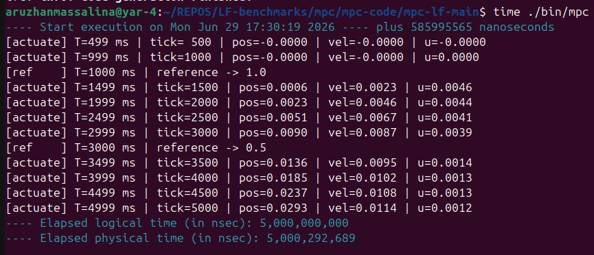

# Lingua Franca Benchmarks

A collection of deterministic, real-time Cyber-Physical System (CPS) benchmarks implemented in [Lingua Franca (LF)](https://www.lf-lang.org/), with POSIX C baselines for comparison.

## Table of Contents

- [1. MPC (Model Predictive Control)](#1-mpc-model-predictive-control)
  - [Project Files](#-project-files)
  - [System Architecture](#system-architecture)
  - [Quick Start and Benchmarking](#quick-start-and-benchmarking)
  - [Execution Results and Timing Analysis](#execution-results--timing-analysis)
  - [Distributed Execution (RTI)](#-distributed-execution-rti)
  - [Performance Results and Real-Time Safety](#-performance-results--real-time-safety)
  - [Architectural Coding Standards](#architectural-coding-standards-enforced)
  - [Why is User CPU So Low?](#why-is-user-cpu-so-low-0001-s)
  - [How Reactors are Connected in Multicore](#how-reactors-are-connected-in-multicore-main-reactor)
  - [How Logical Time Works](#how-logical-time-works-in-lingua-franca)
- [2. Fly-By-Wire (Triple Modular Redundancy)](#2-fly-by-wire-triple-modular-redundancy)
  - [Project Files](#-project-files-1)
  - [System Architecture](#system-architecture-1)
  - [Quick Start and Benchmarking](#quick-start-and-benchmarking-1)
  - [What LF Eliminates](#what-lf-eliminates)
  - [Execution Results & Key Finding](#execution-results--key-finding)
  - [The Math: NMEA Parsing and Haversine Distance](#the-math-nmea-parsing-and-haversine-distance)
  - [Fault Model](#fault-model)
  - [The 2-of-3 Voting Logic](#the-2-of-3-voting-logic)
  - [Architectural Coding Standards](#architectural-coding-standards)
  - [Project Structure](#project-structure)
  - [Summary](#summary)
- [3. (Future Benchmark)](#)

## 1. MPC (Model Predictive Control)
This is a deterministic, real-time Cyber-Physical System (CPS) benchmark for robotics. It demonstrates the translation of a multi-threaded Model Predictive Control (MPC) architecture from standard POSIX C threads into [Lingua Franca (LF)](https://www.lf-lang.org/).

The primary goal of this project is to eliminate the non-determinism, race conditions, and silent real-time failures inherent in standard C multithreading by leveraging Lingua Franca's event-driven, time-aware actor model.

### 📂 Project Files

**Source Code**
* [`mpc-lf-main/mpc.lf`](mpc/mpc-code/mpc-lf-main/mpc.lf) - The deterministic Lingua Franca (LF) implementation of the MPC architecture (non-federated).
* [`mpc-lf-federated/mpc_fed.lf`](mpc/mpc-code/mpc-lf-federated/mpc_fed.lf) - The deterministic Lingua Franca (LF) implementation of the MPC architecture (non-federated).
* [`mpc_threaded.c`](mpc/mpc-code/mpc_threaded.c) - The original POSIX-threaded C baseline used for comparison.

**Benchmarking and Automation**
* [`run_benchmark.py`](mpc/mpc-code/run_benchmark.py) - Python test harness that automates compilation, execution, output parsing, and graph generation.

**Assets and Diagrams**
* [`diagrams-and-results/architecture.png`](mpc/diagrams-and-results/architecture.png) - Visual representation of the Lingua Franca reactor network and data flow.

**Execution Results**
* [`diagrams-and-results/lf_results.txt`](mpc/diagrams-and-results/lf_results.txt) - Raw execution log of the time-aware LF simulation.
* [`diagrams-and-results/c_results.txt`](mpc/diagrams-and-results/c_results.txt) - Raw execution log of the standard C multithreaded simulation.

## System Architecture


---

## Quick Start and Benchmarking

### Prerequisites
To compile and run this benchmark, ensure you have the following installed on a Linux/WSL environment:
* `gcc` and `cmake`
* `lfc` (Lingua Franca Compiler)
* `python3`

### Running the Python Test Harness
The easiest way to evaluate the system is to run the automated Python benchmark script. This script compiles the Lingua Franca code, executes the 5-second real-time simulation and parses the terminal output.

```bash
python3 run_benchmark.py
```

### Manual Compilation
To manually compile and run the LF architecture with physical time enforcement:

```bash
rm -rf src-gen bin
lfc mpc.lf
time ./bin/mpc
```

### Execution Results and Timing Analysis



When comparing the terminal output of the standard C baseline against the Lingua Franca implementation, we observe three critical architectural differences.

**1. Mathematical Correctness (The Physics Match)**
Despite the entirely different concurrency models, the final computed states of the physical system are nearly identical, proving the MPC matrix calculations were ported perfectly.
* **C Baseline Final State:** `pos=0.0306 | vel=0.0111`
* **Lingua Franca Final State:** `pos=0.0292 | vel=0.0114`

**2. Physical Execution Time (`time` utility)**
Because the standard C code lacks a true understanding of time, it either processes the 5,000 logical ticks as fast as the CPU allows (finishing in milliseconds) or relies on unreliable OS-level `sleep()` commands that drift wildly. 
Conversely, Lingua Franca enforces the `fast: false` target property, strictly binding the 1kHz logical clock to the physical clock. 
* **LF Physical Execution Time:** `~5.0005 seconds` (Exactly 5 seconds + minimal startup overhead).

**3. Handling OS Jitter and Deadlines**
A desktop operating system (like Linux/WSL) has background processes that occasionally interrupt the CPU, causing computation lag (jitter). 

**The C Output (Silent Failure):**
```text
[actuate] tick=3500 | pos=0.0152 (ref=0.5000) | vel=0.0091
[actuate] tick=4000 | pos=0.0200 (ref=0.5000) | vel=0.0098
[actuate] tick=4500 | pos=0.0251 (ref=0.5000) | vel=0.0105
```
The C thread lagged and missed the 1ms hardware deadline, but silently ignored it, feeding delayed, stale motor voltages to the robot (which causes instability in physical systems).

**The LF Output (Active Safety):**
```
[WARNING] Optimizer missed 1ms deadline! Applying emergency brakes.
[WARNING] Optimizer missed 1ms deadline! Applying emergency brakes.
[actuate] tick=4000 | pos=0.0184 | vel=0.0101 | u=0.0013
```
Lingua Franca measures physical time against its logical timeline. When the heavy gradient descent math exceeded the strict 1ms hardware deadline due to OS jitter, LF intercepted the failure, aborted the stale math, and triggered the deadline(1 msec) block to safely apply u=0.0 (emergency braking).

## 🌐 Distributed Execution (RTI)


This benchmark can be compiled as a distributed network system using Lingua Franca's Run-Time Infrastructure (RTI). By changing the root component to a `federated reactor`, the compiler automatically generates a network server and splits the application into standalone executables (`mpc_plant`, `mpc_optimizer`, `mpc_ref`).

The RTI acts as a central time-keeper, utilizing clock-synchronization protocols to coordinate logical time across physical TCP/IP network bounds, demonstrating how Lingua Franca scales seamlessly from multi-core threads to multi-node distributed systems.

### What is the RTI?

The RTI (Run-Time Infrastructure) is a central software bus that allows different programs, running on different computers, to talk to each other and share a single unified timeline. It handles the networking, the message routing, and most importantly, the synchronization of time across physical boundaries.

In standard C, if you want a robot's brain to run on a laptop and its spinal cord to run on a chassis, you have to manually write thousands of lines of TCP/IP socket code and deal with network lag causing the robot to crash.

In Lingua Franca, the RTI is an automatically generated **Time Conductor**. When you compile a distributed program, LF builds a dedicated server (the RTI) whose sole job is to force every machine on the network to obey strict Logical Time. Before any node is allowed to execute tick 1500, the RTI ensures that all network messages from tick 1499 have been delivered, and that everyone's physical clocks are perfectly synchronized. It provides deterministic, real-time safety guarantees over an unpredictable Wi-Fi/Ethernet network.

### How We Implemented It

We changed `main reactor` to `federated reactor`:

```lf
federated reactor {
    ref = new Reference()
    plant = new Plant()
    optimizer = new Optimizer()

    ref.x_ref         -> optimizer.x_ref_in
    plant.x           -> optimizer.x_current
    optimizer.u_apply  -> plant.u
}
```

By doing this, the Lingua Franca compiler completely changed its output. Instead of building one executable, it built four independent network binaries:

| Binary | Role |
|---|---|
| `RTI` | The central time-keeper |
| `mpc_ref` | The Remote Control (reference setpoint) |
| `mpc_optimizer` | The Brain (gradient descent MPC solver) |
| `mpc_plant` | The Robot Chassis (sensor readings + actuator commands) |

Because everything ran on a single machine for the benchmark, Lingua Franca intelligently bundled these into a single launcher (`./bin/mpc`) that spun up the RTI server in the background and connected the three federates via local TCP/IP sockets.

### The Execution Lifecycle

**Phase 1: Clock Synchronization (Google Spanner Protocol)**

The RTI boots up first and waits. As `plant`, `optimizer`, and `ref` connect to the network, the RTI refuses to let the simulation start. It first forces them to exchange dozens of ping messages to measure the network latency between them. It then locks their internal clocks together. All three federates reported the exact same starting nanosecond (`1780087519273407295`).

**Phase 2: Latency Catch**

Once execution begins, data must flow through network sockets. Initially, routing the heavy matrix math from the Optimizer to the Plant took slightly longer than the strict 1 ms hardware deadline. Lingua Franca detected this network lag immediately. Instead of using stale, delayed packets, the Plant caught the violation and safely applied the emergency brakes (`u = 0.0`).

**Phase 3: Lock-Step Execution**

Once the network sockets warmed up, the RTI coordinated the distributed system flawlessly. Over a 5.000-second logical simulation, the total physical execution time was 5.002 seconds. The RTI managed all the TCP/IP network overhead in just 2 milliseconds.


### 📊 Performance Results & Real-Time Safety
The "Missed Deadline" Feature
When running this benchmark on a standard desktop operating system (like Ubuntu/WSL), you may see console warnings indicating that the Optimizer missed its 1ms deadline. This is an intentional safety feature, not a bug.

In the original POSIX C implementation, if the CPU lagged and the MPC math took longer than 1 millisecond, the thread would silently fail, feeding stale and delayed motor voltages to the actuator (which causes physical crashes in real robots).

Lingua Franca measures physical hardware time. If the math computation exceeds the 1ms strict deadline, the LF runtime explicitly intercepts the failure and applies emergency braking (u=0.0), proving that LF provides safety guarantees that standard C threading lacks.

## Architectural Coding Standards Enforced

### 1. Strict Memory Isolation (No Mutexes)
Shared memory and condition variables (pthread_cond_wait) are strictly forbidden.
State must be strictly private to the component that owns it. Data (like x_current or u_sequence) must be passed explicitly through time-stamped messages across isolated Ports. Lingua Franca’s runtime handles the synchronization automatically.

**Before (C):**
```c
pthread_mutex_lock(&g_mutex);
memcpy(x0, g_state.x_current, sizeof(x0));
pthread_mutex_unlock(&g_mutex);
```

**After (Lingua Franca):**
```
// Data is safe and passed without locks
reaction(x_current) -> u_apply {=
    double x0[2];
    x0[0] = x_current->value.data[0];
    x0[1] = x_current->value.data[1];
=}
```

### 2. Logical Time Over Physical Sleep
We must never use sleep() or artificial delays to pace a loop.
We must use LF’s native timer construct. To achieve the 1 kHz control loop from the C code, the Sensor and Actuator reactors must be driven by a timer t(0, 1 msec).

**Before (C):**
```c
while (1) {
    sleep_ms(1);  // Relies on unpredictable OS
    // Read sensor data...
}
```

**After (Lingua Franca):**
```
timer t(0, 1 msec) // Mathematically precise logical clock

reaction(t) -> x {=
    // Read sensor data exactly every 1ms...
=}
```

### 3. Explicit Data Flow via Time-Stamped Ports
The execution order must be defined visually by how components are wired together, matching the "Sensor -> Computation -> Actuator" pipeline.
If the Optimizer needs the Sensor's data, the code must explicitly declare sensor.x_current -> optimizer.x_current. LF uses this to build a deterministic execution graph, eliminating race conditions.

**Before (C):**
```c
// Actuator might not listen to this pager (in opimizer thread)
g_state.new_solution = true;
pthread_cond_signal(&g_cond_sol);
```

**After (Lingua Franca):**
```
// The compiler reads this physical arrow to schedule execution
main reactor {
    plant.x -> optimizer.x_current
    optimizer.u_apply -> plant.u
}
```

### 4. Strict Hardware Deadlines
If the C thread's math takes longer than, for example, 1 millisecond, the another thread applies stale (e.g. out-of-date motor commands to the robot), potentially causing hardware failure.
The target is synced to physical time (`fast: false`), and the reactor explicitly utilizes a `deadline(1 msec)` block. If the computation exceeds the physical time boundary, the runtime catches the violation, allowing for safe emergency fallbacks.

**Before (C):**
```
// Runs math for an unknown amount of physical time
for (int iter = 0; iter < OPT_ITER; iter++) {
    // ... some heavy math ...
}
// Blindly applies answer, even if 5 milliseconds late
```

**After (Lingua Franca):**
```
target C {
    timeout: 5 sec,
    fast: false
}
```

```
reaction(x_current) -> u_apply {=
    // ... some heavy math ...
=} deadline(1 msec) {=
    // Safely catches execution if math exceeds physical deadline
    printf("[WARNING] Optimizer missed 1ms real-time deadline!\n");
    // Trigger emergency braking logic here
=}
```

# Why is User CPU So Low? (0.001 s)

When benchmarking the Lingua Franca MPC controller against the C baseline:

```
$ time ./bin/mpc > lf_results.txt
real    0m5.023s
user    0m0.001s     ← almost zero
sys     0m0.592s

$ time ./mpc_threaded > c_results.txt
real    0m6.049s
user    0m6.052s     ← full core, 6 seconds
sys     0m0.258s
```

## The LF runtime is event-driven, it sleeps between tags

A **tag** is a `(time, microstep)` pair representing a logical instant. In our MPC, the Plant's `timer t(0, 1 msec)` creates a new tag every 1 ms, giving us 5,000 tags over the 5-second run.

At each tag, the runtime processes all triggered reactions (the level 0→5 pipeline: sensor → reference → optimizer → actuator).

After all reactions complete, the runtime calls `_lf_next_locked()`, which sleeps until the next tag is due, typically ~1 ms away. During that sleep, **zero user CPU is consumed**.

## The sleep chain in reactor-c

The call chain from "all reactions done" to "thread asleep" is:

```
_lf_next_locked()                         // core/threaded/reactor_threaded.c: advance to next tag
  → get_next_event_tag(env)               // peek at event queue: next tag is 1 ms away
  → wait_until(next_tag.time, &cond)      // reactor_threaded.c: sleep until physical time catches up
    → lf_clock_cond_timedwait(cond, t)    // platform layer: OS-level timed wait. core/clock.c
      → _lf_cond_timedwait(cond, t)       // mpc/low_level_platform/impl/src/lf_POSIX_threads_support.c
        → pthread_cond_timedwait(...)     // POSIX: thread removed from CPU entirely
```

### The key function: `_lf_cond_timedwait`

```c
// From lf_POSIX_threads_support.c
int _lf_cond_timedwait(lf_cond_t* cond, instant_t wakeup_time) {
  // Convert nanoseconds to the struct that POSIX expects
  struct timespec timespec_absolute_time = convert_ns_to_timespec(wakeup_time);

  // THIS LINE puts the thread to sleep:
  int return_value = pthread_cond_timedwait(
      (pthread_cond_t*)&cond->condition,    // the "wake-up signal receiver"
      (pthread_mutex_t*)cond->mutex,         // mutex released while sleeping
      &timespec_absolute_time                // absolute wall-clock deadline
  );

  // Translate OS error code to LF constant
  switch (return_value) {
  case ETIMEDOUT:
    return_value = LF_TIMEOUT;  // slept the full time
    break;
  default:
    break;                      // woken up early by a signal
  }
  return return_value;
}
```

When the hardware timer fires (~1 ms later), the kernel puts the thread back on the run queue, and the program resumes.

### The caller: `wait_until()`

```c
// From reactor_threaded.c
bool wait_until(instant_t wait_until_time, lf_cond_t* condition) {
    // Check if we've already passed the target time
    interval_t wait_duration = wait_until_time - lf_time_physical();
    if (wait_duration < 0) {
        return true;  // already past this time, no sleep needed
    }

    // Sleep until timeout or early wake-up
    if (lf_clock_cond_timedwait(condition, wait_until_time) != LF_TIMEOUT) {
        return false;  // woken early, caller should re-check event queue
    } else {
        return true;   // slept the full duration, ready for next tag
    }
}
```

## Conclusion

```
LF:  0.001 s user CPU  →  the process sleeps between tags, wakes only to compute
C:   6.052 s user CPU  →  four threads burn a full core on lock contention
```

# How Reactors are Connected in Multicore (Main Reactor)

All reactors live in a single process, share an address space, and are connected by three compile-time mechanisms:

1. **Pointer aliasing:** ports are connected by making the input point to the output's memory
2. **Static trigger arrays:** each reaction knows its downstream triggers at compile time
3. **Level-ordered scheduling:** reactions are dispatched by integer priority, with a worker thread pool (deterministic execution order)

All three are set up once during initialization in the generated `mpc.c` file, inside `_lf_initialize_trigger_objects()`. Nothing is computed or negotiated at runtime.

## The three `->` arrows in `mpc.lf`

```lf
main reactor {
    ref = new Reference()
    plant = new Plant()
    optimizer = new Optimizer()

    ref.x_ref         -> optimizer.x_ref_in     // connection 1
    plant.x           -> optimizer.x_current    // connection 2
    optimizer.u_apply  -> plant.u               // connection 3
}
```

Each of these arrows compiles into all three mechanisms described below.

---

## Mechanism 1: Port Wiring: Pointer Aliasing (Zero-Copy)

Near the bottom of `mpc.c`, under the comment `// Connect inputs and outputs`, each `->` arrow becomes a single pointer assignment:

```c
// Connection 1: ref.x_ref -> optimizer.x_ref_in
mpc_optimizer_self[dst_runtime]->_lf_x_ref_in =
    (_optimizer_x_ref_in_t*)&mpc_ref_self[src_runtime]->_lf_x_ref;

// Connection 2: plant.x -> optimizer.x_current
mpc_optimizer_self[dst_runtime]->_lf_x_current =
    (_optimizer_x_current_t*)&mpc_plant_self[src_runtime]->_lf_x;

// Connection 3: optimizer.u_apply -> plant.u
mpc_plant_self[dst_runtime]->_lf_u =
    (_plant_u_t*)&mpc_optimizer_self[src_runtime]->_lf_u_apply;
```

### What this means

The destination's input port **is** the source's output port: same memory address. When the Plant's sensor calls `lf_set(x, current_x)`, it writes into `plant._lf_x.value`. When the Optimizer reads `x_current->value`, it's reading from the exact same struct through a pointer cast. The data is "there" the moment `lf_set` writes it.

### How to find these lines

Search for `// Connect inputs and outputs` in `mpc.c`. The comments above each block identify the connection:

```c
// Connect mpc.ref.x_ref(0,1)->[mpc.optimizer.x_ref_in(0,1)] to port mpc.optimizer.x_ref_in(0,1)
```

---

## Mechanism 2: Trigger Arrays: when the output is produced, who wakes up

Each reaction has a pre-built array of downstream triggers. These are set up in the `// non-nested deferred initialize` section of `mpc.c`.

### The trigger wiring

```c
// Plant sensor (reaction_0) → triggers optimizer's x_current input
mpc_plant_self[src_runtime]->_lf__reaction_0
    .triggers[triggers_index[src_runtime] + src_channel][0]
    = &mpc_optimizer_self[dst_runtime]->_lf__x_current;

// Optimizer MPC (reaction_1) → triggers plant's u input
mpc_optimizer_self[src_runtime]->_lf__reaction_1
    .triggers[triggers_index[src_runtime] + src_channel][0]
    = &mpc_plant_self[dst_runtime]->_lf__u;

// Reference (reaction_0) → triggers optimizer's x_ref_in input
mpc_ref_self[src_runtime]->_lf__reaction_0
    .triggers[triggers_index[src_runtime] + src_channel][0]
    = &mpc_optimizer_self[dst_runtime]->_lf__x_ref_in;
```

> **Note:** Search for `// Point to destination port` to find each line.

### The `output_produced` flag

Each reaction also tracks which output ports it can produce. This is how the runtime knows whether `lf_set` was called:

```c
// Plant sensor knows it can produce on port plant.x
mpc_plant_self[0]->_lf__reaction_0.output_produced[count++]
    = &mpc_plant_self[0]->_lf_x.is_present;
```

### How triggers fire at runtime

After a reaction runs, `_lf_worker_invoke_reaction()` (in `reactor_threaded.c`) calls `schedule_output_reactions()`:

```c
static void _lf_worker_invoke_reaction(env, worker_number, reaction) {
    _lf_invoke_reaction(env, reaction, worker_number);      // run the reaction's C code
    schedule_output_reactions(env, reaction, worker_number); // walk triggers, enqueue downstream
}
```

`schedule_output_reactions()` (in `core/reactor_common.c`) does:

```
for each output port of this reaction:
    if output_produced[i] is true:            // was lf_set() called?
        for each trigger in triggers[i]:      // walk the static trigger array
            for each reaction on that trigger:
                enqueue it into the scheduler (sorted by level)
```

### Debug output proof

The debug log confirms this cascade for every tick:

```
Worker 0: Invoking reaction mpc.plant reaction 0        ← sensor runs, calls lf_set(x, ...)
  Output 0 has been produced.                            ← is_present = true
  Trigger 0x648f933063d8 lists 1 reactions.              ← follows triggers[0][0]
  Enqueueing reaction mpc.optimizer reaction 1, level 4  ← downstream reaction enqueued
```

---

## Mechanism 3: Level order

Each reaction is assigned a topological level at compile time. The scheduler processes all reactions at level N before any at level N+1.

### Level assignments in `mpc.c`

```c
// Level 0: ref startup + plant sensor (can run in PARALLEL)
mpc_ref_self[0]->_lf__reaction_0.index   = lf_combine_deadline_and_level(1000000, 0);
mpc_plant_self[0]->_lf__reaction_0.index  = lf_combine_deadline_and_level(1000000, 0);

// Level 1: ref timer t1
mpc_ref_self[0]->_lf__reaction_1.index    = lf_combine_deadline_and_level(1000000, 1);

// Level 2: ref timer t2
mpc_ref_self[0]->_lf__reaction_2.index    = lf_combine_deadline_and_level(1000000, 2);

// Level 3: optimizer handles x_ref_in
mpc_optimizer_self[0]->_lf__reaction_0.index = lf_combine_deadline_and_level(1000000, 3);

// Level 4: optimizer MPC math (has 1ms deadline)
mpc_optimizer_self[0]->_lf__reaction_1.index = lf_combine_deadline_and_level(1000000, 4);

// Level 5: plant actuator (downstream of everything)
mpc_plant_self[0]->_lf__reaction_1.index  = lf_combine_deadline_and_level(9223372036854775807, 5);
```

### The scheduler array

```c
size_t num_reactions_per_level[6] = {2, 1, 1, 1, 1, 1};
```

This single array is the entire compiled schedule:
- **Level 0** has **2** reactions (Reference startup + Plant sensor): these can run on separate worker threads in **parallel**
- **Levels 1–5** each have **1** reaction: strictly sequential

### Debug output proof

```
Worker 0 popping reaction with level 0     ← plant sensor
Worker 1 popping reaction with level 0     ← ref startup (PARALLEL: different worker)
...
Worker 0 popping reaction with level 3     ← optimizer ref handler
Worker 0 popping reaction with level 4     ← optimizer MPC
Worker 0 popping reaction with level 5     ← plant actuator
```

---

## Putting It All Together: One Tick

Here is the complete pipeline for a single 1 ms tick at tag `(T, 0)`:

```
Timer fires at tag (T, 0)
    │
    ├── _lf_pop_events() pulls timer event from event queue
    │   └── enqueues Plant.reaction_0 (L0) and Ref.reaction_0 (L0)
    │
    ├── Worker 0 runs Plant.reaction_0 (sensor)                    LEVEL 0
    │   ├── lf_set(x, current_x)
    │   │   └── writes into plant._lf_x.value, sets is_present=true
    │   └── schedule_output_reactions()
    │       └── walks triggers[0][0] → enqueues Optimizer.reaction_1 (L4)
    │
    ├── Worker 1 runs Ref.reaction_0 (startup)                     LEVEL 0  ← PARALLEL
    │   ├── lf_set(x_ref, ref)
    │   │   └── writes into ref._lf_x_ref.value, sets is_present=true
    │   └── schedule_output_reactions()
    │       └── walks triggers[0][0] → enqueues Optimizer.reaction_0 (L3)
    │
    ├── Worker 0 runs Optimizer.reaction_0 (L3)                    LEVEL 3
    │   └── reads x_ref_in->value
    │       └── pointer dereference → reads ref._lf_x_ref (same memory)
    │       └── no output produced → no cascade
    │
    ├── Worker 0 runs Optimizer.reaction_1 (L4)                    LEVEL 4
    │   ├── reads x_current->value
    │   │   └── pointer dereference → reads plant._lf_x (same memory)
    │   ├── MPC gradient descent (50 iterations)
    │   ├── lf_set(u_apply, u_seq[0][0])
    │   └── schedule_output_reactions()
    │       └── walks triggers[0][0] → enqueues Plant.reaction_1 (L5)
    │
    ├── Worker 0 runs Plant.reaction_1 (L5, actuator)              LEVEL 5
    │   └── reads u->value
    │       └── pointer dereference → reads optimizer._lf_u_apply (same memory)
    │       └── updates plant_x state, no output → end of chain
    │
    └── _lf_next_locked()
        └── wait_until() → pthread_cond_timedwait() → sleep ~1 ms
```

---

## Contrast: Main Reactor vs. Federated Reactor

| | Main Reactor (multicore) | Federated Reactor |
|---|---|---|
| **Process model** | Single binary, shared address space, worker thread pool | Separate binary per reactor, separate address spaces |
| **Data transfer** | Pointer alias: zero-copy, same memory | Serialize → TCP socket → RTI routes → TCP → deserialize |
| **Signaling** | `schedule_output_reactions()` walks a static C array in-process | `MSG_TYPE_TAGGED_MESSAGE` sent over network |
| **Time coordination** | Single scheduler advances all reactors via `_lf_next_locked()` | RTI exchanges `NET` / `TAG` messages to grant time advancement |
| **Overhead per message** | One pointer dereference + array walk | Network round-trip + serialization/deserialization |

The `mpc.lf` source code is **identical** in both modes. The three `->` connection lines mean the same thing semantically: the compiler decides whether they become pointer casts (main reactor) or network channels (federated reactor) based on the top-level reactor declaration.

---

## Source File Reference

| Evidence | Location |
|---|---|
| Port pointer aliasing | `mpc.c`: search `// Connect inputs and outputs` |
| Trigger array wiring | `mpc.c`: search `// Point to destination port` |
| `output_produced` flags | `mpc.c`: search `output_produced[count++]` |
| Level assignments | `mpc.c`: search `lf_combine_deadline_and_level` |
| Scheduler array | `mpc.c`: search `num_reactions_per_level` |
| Worker invoke + cascade | `reactor_threaded.c`: `_lf_worker_invoke_reaction()` |
| Sleep between tags | `reactor_threaded.c`: `_lf_next_locked()` → `wait_until()` |
| OS-level sleep | `lf_POSIX_threads_support.c`: `_lf_cond_timedwait()` |

# How Logical Time Works in Lingua Franca

Logical time in Lingua Franca is is a **variable that jumps forward from event to event.** The runtime reads the next event's timestamp from a priority queue and sets the current tag to that value. Between events, logical time does not advance: the thread sleeps.

## The Variable That Holds Logical Time

Every environment has one field that stores the current logical time:

```c
env->current_tag    // struct: { .time = nanoseconds, .microstep = int }
```

A **tag** is a `(time, microstep)` pair. The `time` component is an absolute timestamp in nanoseconds. The `microstep` handles logically simultaneous events: if two things happen at the same physical time, they get microsteps 0, 1, 2, etc.

For our MPC running at 1 kHz for 5 seconds, the tags are:

```
(0, 0)          ← startup
(1000000, 0)    ← 1 ms
(2000000, 0)    ← 2 ms
(3000000, 0)    ← 3 ms
...
(5000000000, 0) ← 5 seconds (stop tag)
```

There is no intermediate logical time between tags: no 0.5 ms, no 1.5 ms. Logical time jumps directly from one event to the next.

## How Logical Time Advances

The advancement happens inside `_lf_next_locked()` in `reactor_threaded.c`, in three steps:

### Step 1: Peek at the event queue

```c
tag_t next_tag = get_next_event_tag(env);
```

The event queue is a **priority queue sorted by tag.** `get_next_event_tag()` peeks at the earliest event without removing it. For our MPC, this returns the next timer tick (e.g., `{.time = start_time + 3000000, .microstep = 0}` for the 3 ms tag).

### Step 2: Sleep until physical time catches up

```c
// Inside the while(true) loop in _lf_next_locked():
if (wait_until(next_tag.time, &env->event_q_changed)) {
    break;  // slept the full time: ready to advance
}
```

`wait_until()` calls `lf_clock_cond_timedwait()`, which calls `pthread_cond_timedwait()`, which puts the thread to sleep until either the target time is reached or the condition variable is signaled. During this sleep, zero user CPU is consumed.

### Step 3: Jump logical time forward

```c
_lf_advance_tag(env, next_tag);
// This does: env->current_tag = next_tag
```

Logical time is now at the new tag. It didn't increment through intermediate values, it jumped directly. If the previous tag was `(2000000, 0)` and the next event is at `(3000000, 0)`, logical time jumps from 2 ms to 3 ms in one assignment.

### After advancing: pop events and run reactions

```c
_lf_start_time_step(env);     // reset ports from previous tag
_lf_pop_events(env);          // pull events at this tag, enqueue triggered reactions
```

`_lf_pop_events()` removes all events with the current tag from the event queue and enqueues their triggered reactions into the scheduler's reaction queue, sorted by level. Workers then pick up and execute those reactions.

## Where Events Come From

Events enter the priority queue in two ways:

### 1. Timers: periodic events

In the generated `mpc.c`, the Plant's timer is registered at initialization:

```c
mpc_plant_self[0]->_lf__t.offset = 0;        // first fire at time 0
mpc_plant_self[0]->_lf__t.period = MSEC(1);   // then every 1 ms
```

When a timer fires at tag `(T, 0)`, the runtime inserts the **next** firing into the event queue at tag `(T + period, 0)`. The debug output shows this:

```
Inserting event in the event queue with elapsed tag (2000000, 0).
```

That's the 1 ms timer saying "fire me again at 2 ms." This creates the chain of events that drives the entire MPC loop.

Similarly, the Reference reactor's one-shot timers are registered:

```c
mpc_ref_self[0]->_lf__t1.offset = SEC(1);   // fire once at t = 1 second
mpc_ref_self[0]->_lf__t1.period = 0;         // period = 0 → one-shot, no repeat

mpc_ref_self[0]->_lf__t2.offset = SEC(3);   // fire once at t = 3 seconds
mpc_ref_self[0]->_lf__t2.period = 0;
```

### 2. Reactions that call `lf_set`: cascades within the same tag

When a reaction calls `lf_set()` on an output port, the downstream reactions are enqueued at the **current** tag, logical time does not advance. The cascade happens within the same logical instant:

```
Tag (1000000, 0):
    Plant sensor runs          → lf_set(x, ...)      → enqueues Optimizer L4
    Optimizer runs             → lf_set(u_apply, ...) → enqueues Plant actuator L5
    Plant actuator runs        → updates state, no output
    
    All at the SAME logical time: 1 ms
```

## Event Queue State During Execution

At startup, the event queue contains:

```
(0, 0)            ← Plant timer (period=1ms) + startup events
(1000000000, 0)   ← Reference t1 (fires once at 1 second)
(3000000000, 0)   ← Reference t2 (fires once at 3 seconds)
```

After processing tag `(0, 0)`, the Plant timer inserts its next firing:

```
(1000000, 0)      ← Plant timer next tick (1 ms)
(1000000000, 0)   ← Reference t1 (still waiting)
(3000000000, 0)   ← Reference t2 (still waiting)
```

After processing tag `(1000000, 0)`:

```
(2000000, 0)      ← Plant timer next tick (2 ms)
(1000000000, 0)   ← Reference t1
(3000000000, 0)   ← Reference t2
```

This pattern continues: each tick pops one timer event and inserts the next one. The Reference timers sit in the queue until their time comes.

## Logical Time vs. Physical Time

| | Logical time | Physical time |
|---|---|---|
| **What it is** | A variable: `env->current_tag` | The hardware clock: `clock_gettime()` |
| **How it advances** | Jumps from event to event | Flows continuously |
| **Who controls it** | The event queue | Physics (the real world) |
| **Read via** | `lf_time_logical_elapsed()` | `lf_time_physical_elapsed()` |

The deadline mechanism connects the two: if physical time exceeds logical time + deadline, the violation handler fires. This is checked in `_lf_worker_handle_deadline_violation_for_reaction()`:

```c
if (reaction->deadline >= 0LL) {
    instant_t physical_time = lf_time_physical();
    if (physical_time > lf_time_add(env->current_tag.time, reaction->deadline)) {
        // Deadline violation: invoke handler (emergency brake)
    }
}
```

## Conclusion

Logical time **jumps** from event to event. If a program had no events between 1 ms and 500 ms, logical time would jump directly from 1 ms to 500 ms in one step, and `wait_until()` would sleep for 499 ms. The event queue drives everything. No events means no time advancement.

This is why `lf_time_logical_elapsed()` works in print statements: it just reads `env->current_tag.time - start_time` and returns the difference. It's reading a variable, not measuring a clock.

## The Complete Cycle: One Tick

```
env->current_tag = (T, 0)           ← logical time is at T

_lf_pop_events()                    ← pull events at tag (T, 0)
  └── enqueues triggered reactions

Workers execute reactions:
  L0: Plant sensor → lf_set(x)     ← cascade: enqueue L4
  L4: Optimizer MPC → lf_set(u)    ← cascade: enqueue L5
  L5: Plant actuator               ← end of chain

_lf_next_locked():
  next_tag = get_next_event_tag()   ← peek: (T + 1ms, 0)
  wait_until(next_tag.time)         ← sleep until physical time reaches T + 1ms
  _lf_advance_tag(env, next_tag)    ← env->current_tag = (T + 1ms, 0)

env->current_tag = (T + 1ms, 0)    ← logical time jumped forward

...repeat 5,000 times...
```

## Source File Reference

| Concept | Location |
|---|---|
| Current tag variable | `env->current_tag` (defined in `environment.h`) |
| Tag advancement | `_lf_advance_tag()` called in `_lf_next_locked()` (`reactor_threaded.c`) |
| Event queue peek | `get_next_event_tag()` (`reactor_threaded.c`) |
| Event popping | `_lf_pop_events()` (`reactor_common.c`) |
| Sleep between tags | `wait_until()` → `lf_clock_cond_timedwait()` → `_lf_cond_timedwait()` |
| Timer registration | `mpc.c`:`_lf__t.offset` and `_lf__t.period` fields |
| Timer rescheduling | `lf_schedule_trigger()` called after timer fires |
| Deadline check | `_lf_worker_handle_deadline_violation_for_reaction()` (`reactor_threaded.c`) |
| Read logical time | `lf_time_logical_elapsed()` → reads `env->current_tag.time - start_time` (mpc/core/reactor_common.c)|
| Read physical time | `lf_time_physical()` → calls `clock_gettime(CLOCK_MONOTONIC)` (mpc/low_level_platform/impl/src/lf_windows_support.c)|

## 2. Fly-By-Wire (Triple Modular Redundancy)

This is a deterministic, fault-tolerant Cyber-Physical System (CPS) benchmark for avionics. It demonstrates the translation of a multi-process Fly-By-Wire architecture — inspired by the Boeing 777 Primary Flight Control System — from standard POSIX C (7 processes, 5 IPC mechanisms) into [Lingua Franca (LF)](https://www.lf-lang.org/).

The original C implementation uses sockets, pipes, shared files, log-file-based voting, named pipes, and POSIX signals to coordinate 7 concurrent processes. The LF port replaces all of this with identical timestamped ports, eliminating an entire class of timing-drift false positives that the C version produces.

**Original source:** [github.com/Wabri/Fly-By-Wire](https://github.com/Wabri/Fly-By-Wire) (University of Florence, Operating Systems course, 2019/2020)

### 📂 Project Files

**Source Code**
* [`fbw-lf/fbw.lf`](fbw-lf/fbw.lf) — The deterministic Lingua Franca implementation (7 reactors, zero IPC boilerplate).
* [`fbw-lf/fbw_nav.h`](fbw-lf/fbw_nav.h) — Navigation math extracted from the original: NMEA GPGLL parsing, Haversine distance, speed computation.
* [`Fly-By-Wire/`](Fly-By-Wire/) — The original POSIX C baseline (7 processes, 5 IPC mechanisms).

**Benchmarking and Automation**
* [`fbw-lf/run_fbw.py`](fbw-lf/run_fbw.py) — Python script that compiles and runs the LF implementation.

**Data**
* [`fbw-lf/G18.txt`](fbw-lf/G18.txt) — NMEA GPS data collected by a GARMIN G18 in an open environment (1,499 GPGLL records, ~25 minutes at 1 Hz).

### System Architecture

The system implements **Triple Modular Redundancy (TMR)** — three identical flight computers (PFCs) independently compute speed from GPS data, and a voter (WES) performs 2-of-3 majority voting to detect faults.

**Components (Boeing 777 inspired, simplified):**

| Component | Role | C Processes | LF Reactors |
|---|---|---|---|
| PFC1, PFC2, PFC3 | Parse NMEA, compute speed (Haversine) | 3 separate processes | 3 instances of one `PFC` reactor |
| Transducer | Receive speeds, log them | 1 process (forks 3 sub-processes) | 1 `Transducer` reactor |
| Failure Generator (FMAN) | Inject random faults into PFCs | 1 process | 1 `FailureGenerator` reactor |
| WES | 2-of-3 voting on speed agreement | 1 process | 1 `WES` reactor |
| PFC Disconnect Switch | Handle errors/emergencies | 1 process | 1 `DisconnectSwitch` reactor |

### Quick Start and Benchmarking

#### Prerequisites

* `gcc` and `cmake`
* `lfc` (Lingua Franca Compiler)
* `python3`

#### Running the LF Implementation

```bash
cd fbw-lf
python3 run_fbw.py
```

Or manually:

```bash
cd fbw-lf
lfc fbw.lf
./bin/fbw
```

The timeout is set to 120 seconds by default. To run the full 25-minute dataset, change `timeout: 120 sec` to `timeout: 1500 sec` in `fbw.lf` and recompile.

#### Running the Original C Baseline

```bash
cd Fly-By-Wire
make run CC=gcc
```

The full dataset takes ~25 minutes. Watch the logs in a second terminal:

```bash
tail -f Fly-By-Wire/log/status.log      # WES voting results
tail -f Fly-By-Wire/log/failures.log     # Fault injection log
```

### What LF Eliminates

The original C implementation uses **5 different IPC mechanisms** and **POSIX signals**, all hand-managed:

| C Baseline | LF Replacement |
|---|---|
| AF_UNIX socket (PFC1 → Transducer) | LF port (identical for all PFCs) |
| Named pipe (PFC2 → Transducer) | LF port |
| Shared file (PFC3 → Transducer) | LF port |
| Log file reading (Transducer → WES via speedPFC*.log) | Direct LF port connection |
| Named pipe (WES → PFCDS) | LF port |
| POSIX signals: SIGSTOP, SIGINT, SIGCONT, SIGUSR1 (FMAN → PFCs) | Fault messages on LF ports |
| PID file (`filePID.log`) for inter-process discovery | Not needed — reactors are wired at compile time |
| `fork()` × 7 for process creation | Reactor instantiation |
| `sleep(1)` for 1 Hz pacing | `timer t(0, 1 sec)` on the logical timeline |

In LF, all three PFCs become **instances of the same reactor class**. The IPC distinction (socket vs. pipe vs. file) vanishes entirely — every connection is an identical timestamped port.

### Execution Results & Key Finding

#### The False-Positive Timing Drift Problem

The most significant finding is a **systematic false-positive error** in the C baseline that does not exist in the LF version.

**The C Baseline Output (`status.log`):**
```
Error 13527
 508:0.000000 507:0.000000 508:0.000000
Error 13527
 509:0.000000 508:0.000000 509:0.000000
Error 13527
 510:0.000000 509:0.000000 510:0.000000
```

PFC2 (the middle value) is **consistently one tick behind** the other two. Counter 507 when the others are at 508, counter 508 when the others are at 509. The speeds are all `0.000000` — mathematically identical — but the WES reports hundreds of errors because the **counters don't match**.

**The cause:** PFC2 communicates via a named pipe, which has slightly different latency than PFC1's socket and PFC3's shared file. The `sleep(1)` coordination between PFC2 and its Transducer sub-process drifts over time. When WES compares all three at the same wall-clock instant, PFC2's data hasn't arrived yet — a **false positive** caused by IPC timing, not by actual speed disagreement.

**The LF Output:**
```
[WES   ] T=0 s | OK — all speeds agree: 0.0000
[WES   ] T=1 s | OK — all speeds agree: 0.0000
[WES   ] T=2 s | OK — all speeds agree: 0.0000
...
[WES   ] T=112 s | OK — all speeds agree: 0.0000
[FMAN  ] T=113 s | STOP sent to PFC1
[PFC1  ] T=113 s | STOPPED by failure generator
[WES   ] T=113 s | ERROR — PFC1 discordant (0.0000 vs 0.0000)
```

**Zero false positives.** All three PFCs are triggered by the same `timer t(0, 1 sec)`, and all three outputs are processed at the same logical tag. There is no drift because there is no `sleep(1)` to drift — the runtime guarantees all three speeds are compared at the same logical instant. The only error reported is a **real** one: PFC1 was stopped by the Failure Generator and stopped producing output.

This is the strongest argument for LF in this benchmark: **the C version's own voting system is undermined by its IPC timing, producing hundreds of false alarms that mask real faults.** LF makes false positives from timing drift structurally impossible.

#### Timing Precision

```
---- Elapsed logical time (in nsec): 120,000,000,000
---- Elapsed physical time (in nsec): 120,000,657,984
```

Over 120 seconds, the total physical overhead is **0.66 ms** — effectively perfect alignment between logical and physical time.

### The Math: NMEA Parsing and Haversine Distance

The navigation math is extracted into `fbw_nav.h`, preserving the exact formulas from the original `structure.c`:

**NMEA GPGLL Parsing:** Each line like `$GPGLL,4424.8422,N,00852.8469,E,122230,V*3B` is parsed into latitude, longitude, and fix time using `sscanf`.

**Haversine Distance:** The distance between consecutive GPS fixes is computed using the standard spherical formula:

```
Δlat = (lat₂ - lat₁) × π/180
Δlon = (lon₂ - lon₁) × π/180
a = sin²(Δlat/2) + sin²(Δlon/2) × cos(lat₁) × cos(lat₂)
c = 2 × atan2(√a, √(1-a))
distance = 6371 km × c
```

**Speed Accumulation:** `speed(k) = speed(k-1) + distance(k) / Δt`, matching the original `addPoint()` logic.

**SIGUSR1 Bias:** The fault injection applies a 2-bit left shift to the rounded speed: `(int)round(speed) << 2`, matching the original `pfc.c` behavior.

### Fault Model

The Failure Generator randomly selects a PFC each tick and sends faults based on configurable probabilities:

| Fault | C Mechanism | LF Mechanism | Probability | Effect |
|---|---|---|---|---|
| STOP | `kill(pid, SIGSTOP)` | `FAULT_STOP` message on port | 1% | PFC stops producing output |
| CONT | `kill(pid, SIGCONT)` | `FAULT_CONT` message on port | 10% | PFC resumes producing output |
| INT | `kill(pid, SIGINT)` | `FAULT_INT` message on port | 0.01% | PFC permanently killed |
| BIAS | `kill(pid, SIGUSR1)` | `FAULT_BIAS` message on port | 10% | Next speed value corrupted (left shift 2 bits) |

In the C version, these are OS-level process signals that require PID tracking, signal handlers, and careful race-condition management. In LF, they are typed messages on ports — the PFC reactor checks state flags (`active`, `alive`, `bias`) each tick and adjusts its behavior accordingly. A stopped PFC simply doesn't call `lf_set` on its output port — downstream reactors see `is_present = false`.

### The 2-of-3 Voting Logic

The WES reactor implements Triple Modular Redundancy voting:

| Condition | WES Output | PFCDS Action |
|---|---|---|
| All 3 speeds agree | OK | No action |
| 2 agree, PFC1 differs | ERROR — PFC1 | Log fault |
| 2 agree, PFC2 differs | ERROR — PFC2 | Log fault |
| 2 agree, PFC3 differs | ERROR — PFC3 | Log fault |
| All 3 disagree | EMERGENCY | `lf_request_stop()` — terminate system |

In the C version, WES reads three log files (`speedPFC1.log`, `speedPFC2.log`, `speedPFC3.log`) every second and compares values. This file-based approach introduces the timing drift that causes false positives. In LF, WES receives speeds directly on ports — no files, no drift, no false positives.

### Architectural Coding Standards

#### 1. Triple Modular Redundancy via Reactor Instantiation

In the C version, three PFCs are identical code that differ only in IPC method. In LF, they are three instances of one reactor class:

**Before (C) — three different IPC setups for identical code:**
```c
pidPFCs[0] = fork();
if (pidPFCs[0] == 0) { pfc(g18Path, PFC_SOCK_SENTENCE, PFC_TRANS_SOCKET); }

pidPFCs[1] = fork();
if (pidPFCs[1] == 0) { pfc(g18Path, PFC_PIPE_SENTENCE, PFC_TRANS_PIPE); }

pidPFCs[2] = fork();
if (pidPFCs[2] == 0) { pfc(g18Path, PFC_FILE_SENTENCE, PFC_TRANS_FILE); }
```

**After (LF) — three instances, zero IPC distinction:**
```lf
pfc1 = new PFC(id=1)
pfc2 = new PFC(id=2)
pfc3 = new PFC(id=3)

pfc1.speed_out -> trans.speed1
pfc2.speed_out -> trans.speed2
pfc3.speed_out -> trans.speed3
```

#### 2. Fault Injection via Ports, Not Signals

**Before (C) — POSIX signals requiring PID tracking:**
```c
int selectedPFC = randRange(3);
if (randPercent() <= FMAN_PROB_STOP) {
    kill(pidPFCs[selectedPFC], SIGSTOP);
}
```

**After (LF) — typed messages on ports:**
```lf
reaction(t) -> fault1, fault2, fault3 {=
    int selected = rand() % 3;
    if ((double)rand() / RAND_MAX <= 0.01) {
        int f = FAULT_STOP;
        switch (selected) {
            case 0: lf_set(fault1, f); break;
            case 1: lf_set(fault2, f); break;
            case 2: lf_set(fault3, f); break;
        }
    }
=}
```

#### 3. Direct Voting, Not File-Based Comparison

**Before (C) — WES reads log files and compares stale data:**
```c
swpfc[0].logFile = fopen("speedPFC1.log", "r");
swpfc[1].logFile = fopen("speedPFC2.log", "r");
swpfc[2].logFile = fopen("speedPFC3.log", "r");
// Compare values read from files — subject to timing drift
```

**After (LF) — WES receives speeds directly on ports:**
```lf
reaction(speed1) {=
    self->last_s1 = speed1->value;
=}
// All three arrive at the same logical tag — no drift possible
```

#### 4. Emergency Shutdown via `lf_request_stop()`

**Before (C) — kill all processes by PID:**
```c
for (int index = 0; index < 6; index++) {
    kill(pids[index], SIGKILL);
}
```

**After (LF) — clean deterministic shutdown:**
```lf
case STATUS_EMERGENCY:
    printf("[PFCDS] EMERGENCY — Terminating system.\n");
    lf_request_stop();
    break;
```

### Project Structure

```
LF-benchmarks/
├── fbw-lf/                          ← Lingua Franca implementation
│   ├── fbw.lf                       ← 7 reactors, zero IPC boilerplate
│   ├── fbw_nav.h                    ← Navigation math (Haversine, NMEA parsing)
│   ├── G18.txt                      ← GPS dataset (1,499 records)
│   └── run_fbw.py                   ← Compile and run script
└── Fly-By-Wire/                     ← Original C baseline
    ├── src/
    │   ├── main.c                   ← 7× fork()
    │   ├── pfc/pfc.c                ← PFC with 3 IPC variants
    │   ├── pfc/structure.c          ← NMEA parsing + Haversine math
    │   ├── transducer/transducer.c  ← 3 sub-processes for socket/pipe/file
    │   ├── fman/fman.c              ← Failure generator (POSIX signals)
    │   ├── wes/wes.c                ← 2-of-3 voting via log file reading
    │   ├── pfcds/pfcds.c            ← Disconnect switch (kill by PID)
    │   └── config.h                 ← Probabilities, paths, constants
    ├── data/G18.txt                 ← GPS dataset
    └── Makefile                     ← Build with: make run CC=gcc
```

### Summary

| | C Baseline (7 POSIX processes) | Lingua Franca (7 reactors) |
|---|---|---|
| **IPC mechanisms** | 5 (socket, pipe, file, log reading, named pipe) | 0 (all LF ports) |
| **Lines of IPC code** | ~300 (connection.c, signal handlers, PID files) | 0 |
| **False-positive errors** | Hundreds (PFC2 pipe latency drift) | 0 |
| **Process coordination** | `sleep(1)` + `fork()` + PID tracking | `timer t(0, 1 sec)` + reactor wiring |
| **Fault injection** | POSIX signals (`kill(pid, SIG*)`) | Typed messages on ports |
| **Emergency shutdown** | `kill(pid, SIGKILL)` × 6 | `lf_request_stop()` |
| **Timing precision (120s run)** | Drift (PFC2 one tick behind) | 0.66 ms overhead |
| **PFC code duplication** | Same code, 3 IPC variants | 3 instances of 1 reactor class |
